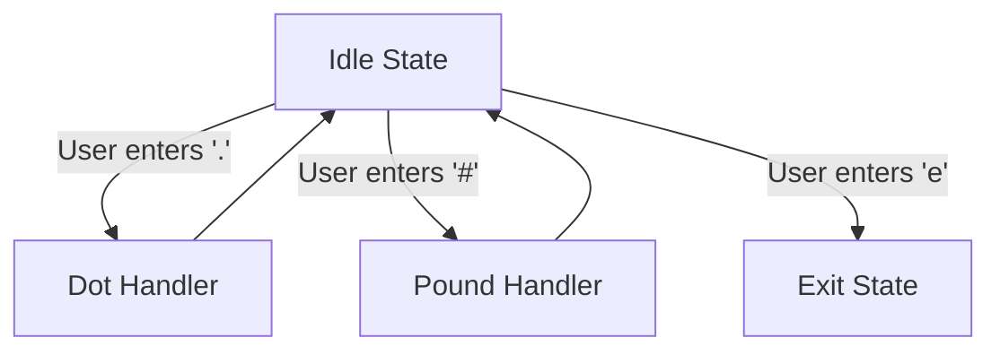

# State Machine Demonstration



## Description (English)

This program is designed to demonstrate the fundamental implementation of a state machine for an interactive application. It does not perform a significant function but merely illustrates states and transition guards within a state machine.

The state machine consists of:
- **Idle State**: A state where the machine waits for user input.
- **Dot Handler**: Outputs dots (.) continuously.
- **Pound Handler**: Outputs pound symbols (#) continuously.
- **Exit State**: Signals the machine's termination.

### Usage

1. Compile the code using CMake:
   ```bash
   cmake -B build
   cmake --build build/
   ./build/StateMachineDemo
   ```
2. Run the program and interact with the state machine by entering '.', '#' or 'e' to explore its behavior.

### Note for Students

Pay attention to the placement of `std::flush` in the code and consider what it does in terms of output buffering and ensuring immediate output to the console.

### Resources

- [Programming 101 Lecture Slides](https://github.com/MaxClerkwell/programming101/)
- Follow me on [X.com](https://x.com/MaxClerkwell) for updates.

---

## Beschreibung (Deutsch)

Dieses Programm dient dazu, die prinzipielle Implementierung einer Zustandsmaschine (State-Machine) für eine interaktive Anwendung zu demonstrieren. Es erfüllt keine tiefgreifende Funktion, sondern stellt lediglich die Zustände und Transition-Guards dar, die in einer State-Machine verwendet werden können.

Die Zustandsmaschine besteht aus:
- **Idle-Zustand**: Ein Leerlaufzustand, in dem das Programm auf Benutzereingaben wartet.
- **Dot Handler**: Gibt kontinuierlich Punkte (.) aus.
- **Pound Handler**: Gibt kontinuierlich Rautezeichen (#) aus.
- **Exit-Zustand**: Signalisiert das Beenden des Programms.

### Verwendung

1. Kompilieren Sie den Code mit CMake:
   ```bash
   cmake -B build
   cmake --build build/
   ./build/StateMachineDemo
   ```
2. Führen Sie das Programm aus und interagieren Sie mit der Zustandsmaschine, indem Sie '.', '#' oder 'e' eingeben, um ihr Verhalten zu erkunden.

### Hinweis für Studenten

Achten Sie auf die Platzierung von `std::flush` im Code und überlegen Sie, welche Wirkung es auf die Ausgabe in der Konsole hat.

### Ressourcen

- [Vorlesungsfolien zu Programmierung 101](https://github.com/MaxClerkwell/programming101/)
- Folgen Sie mir auf [X.com](https://x.com/MaxClerkwell) für Updates.
