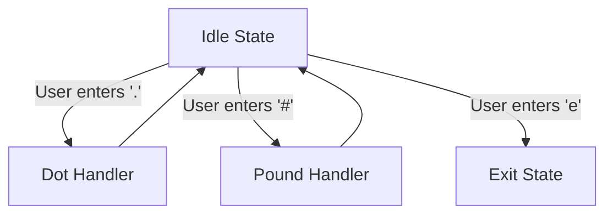
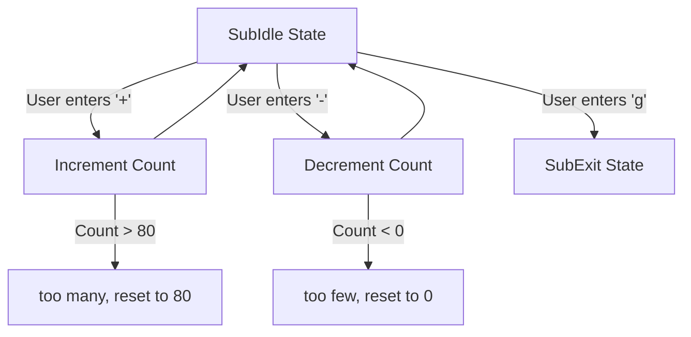

# State Machine Demonstration





## Description (English)

This program is designed to demonstrate the fundamental implementation of a state machine for an interactive application. It does not perform a significant function but merely illustrates states and transition guards within a state machine.

The state machine consists of:
- **Idle State**: A state where the machine waits for user input.
- **Dot Handler**: Outputs dots (.) continuously, with a customizable delay.
- **Pound Handler**: Outputs pound symbols (#) continuously, allowing users to increment or decrement the count dynamically.
- **Exit State**: Signals the machine's termination.

### Usage

1. Compile the code using CMake:
   ```bash
   cmake -B build
   cmake --build build/
   ./build/StateMachineDemo
   ```
2. Run the program and interact with the state machine by:
   - Entering `.` to switch to the Dot Handler.
   - Entering `#` to switch to the Pound Handler.
   - Entering `e` to exit the program.

3. In the **Pound Handler**, you can:
   - Press `+` to increment the number of `#`.
   - Press `-` to decrement the number of `#`.
   - Press `g` to return to the Idle State.

### Note for Students

- Pay attention to the placement of `std::flush` in the code and how it affects immediate output to the console.
- Observe how the console is cleared with `system("clear")` or `system("cls")` and consider its impact on user experience.

### Resources

- [Programming 101 Lecture Slides](https://github.com/MaxClerkwell/programming101/)
- Follow me on [X.com](https://x.com/MaxClerkwell) for updates.

---

## Beschreibung (Deutsch)

Dieses Programm dient dazu, die prinzipielle Implementierung einer Zustandsmaschine (State-Machine) für eine interaktive Anwendung zu demonstrieren. Es erfüllt keine tiefgreifende Funktion, sondern stellt lediglich die Zustände und Transition-Guards dar, die in einer State-Machine verwendet werden können.

Die Zustandsmaschine besteht aus:
- **Idle-Zustand**: Ein Leerlaufzustand, in dem das Programm auf Benutzereingaben wartet.
- **Dot Handler**: Gibt kontinuierlich Punkte (.) aus, mit einer anpassbaren Verzögerung.
- **Pound Handler**: Gibt kontinuierlich Rautezeichen (#) aus, wobei der Benutzer die Anzahl dynamisch erhöhen oder verringern kann.
- **Exit-Zustand**: Signalisiert das Beenden des Programms.

### Verwendung

1. Kompilieren Sie den Code mit CMake:
   ```bash
   cmake -B build
   cmake --build build/
   ./build/StateMachineDemo
   ```
2. Führen Sie das Programm aus und interagieren Sie mit der Zustandsmaschine, indem Sie:
   - `.` eingeben, um zum Dot Handler zu wechseln.
   - `#` eingeben, um zum Pound Handler zu wechseln.
   - `e` eingeben, um das Programm zu beenden.

3. Im **Pound Handler** können Sie:
   - `+` drücken, um die Anzahl der `#` zu erhöhen.
   - `-` drücken, um die Anzahl der `#` zu verringern.
   - `g` drücken, um zum Idle-Zustand zurückzukehren.

### Hinweis für Studenten

- Achten Sie auf die Platzierung von `std::flush` im Code und darauf, welche Wirkung es auf die unmittelbare Konsolenausgabe hat.
- Beachten Sie, wie die Konsole mit `system("clear")` oder `system("cls")` bereinigt wird und welche Auswirkungen dies auf die Benutzererfahrung hat.

### Ressourcen

- [Vorlesungsfolien zu Programmierung 101](https://github.com/MaxClerkwell/programming101/)
- Folgen Sie mir auf [X.com](https://x.com/MaxClerkwell) für Updates.
